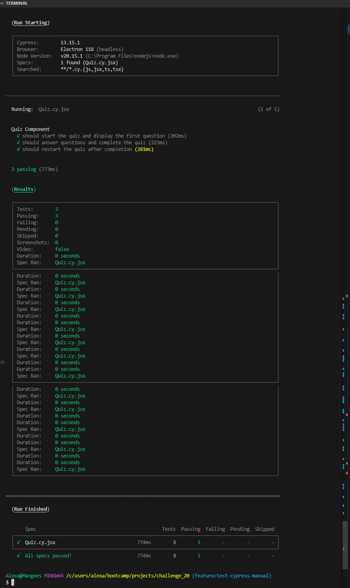
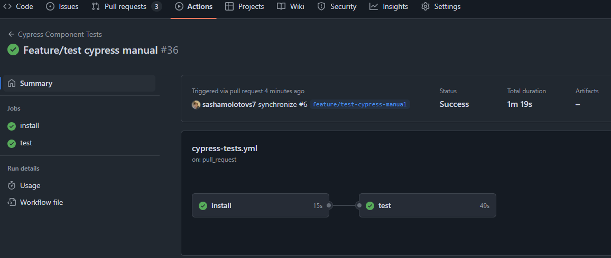

# CI-CD Quality Checker

## Project Overview
This project is a full-stack application designed to implement a CI/CD pipeline using GitHub Actions and Render. It includes automated testing and deployment workflows to ensure code quality and streamline the deployment process.

## Table of Contents
- [CI-CD Quality Checker](#ci-cd-quality-checker)
  - [Project Overview](#project-overview)
  - [Table of Contents](#table-of-contents)
  - [Features](#features)
  - [Technology Stack](#technology-stack)
  - [Installation](#installation)




## Features
- Automated testing with Cypress for component validation.
- Continuous Integration (CI) workflow triggered on Pull Requests to the `develop` branch.
- Continuous Deployment (CD) to Render when code is merged to the `main` branch.
- MongoDB integration for data persistence.

## Technology Stack
- **Frontend**: React, Vite
- **Backend**: Node.js, Express, MongoDB
- **Testing**: Cypress
- **CI/CD**: GitHub Actions, Render

## Installation
1. Clone the repository:
   ```bash
   git clone git@github.com:sashamolotovs7/CI-CD-Quality-Checker.git


